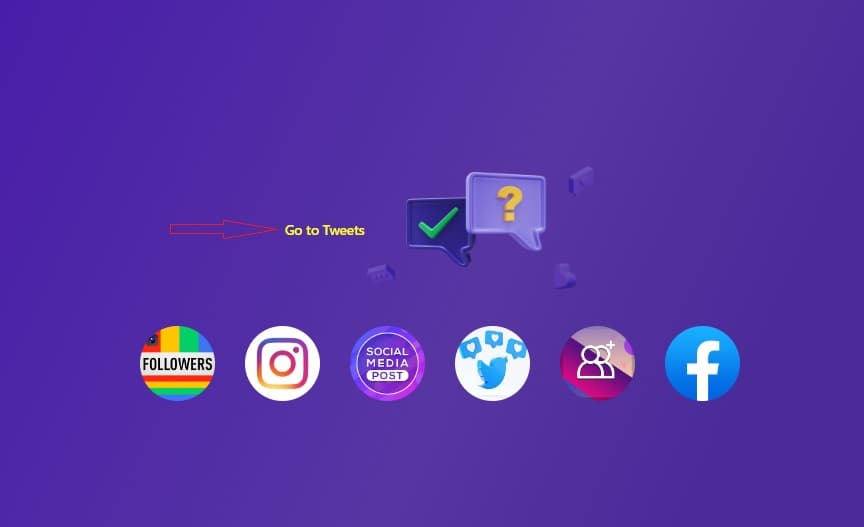
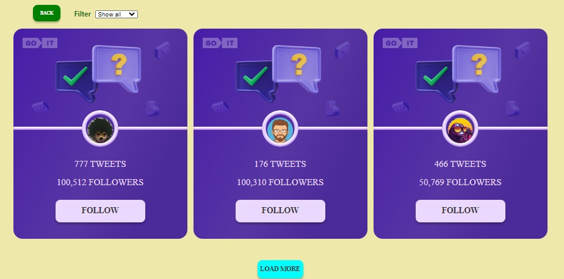
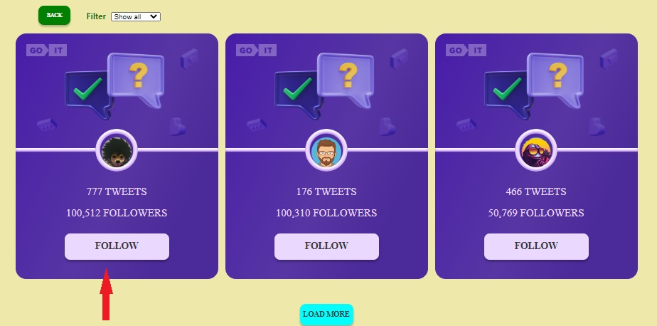
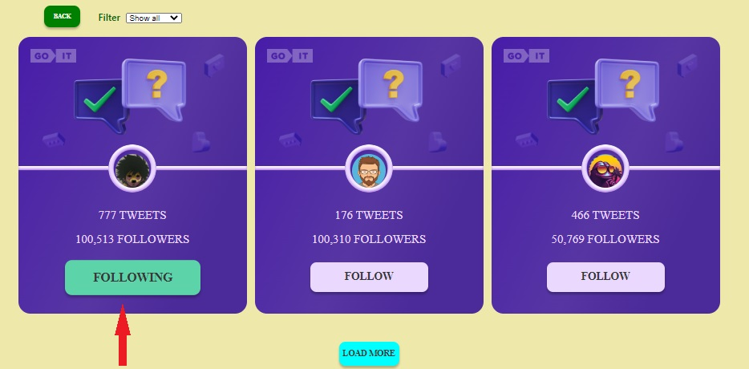
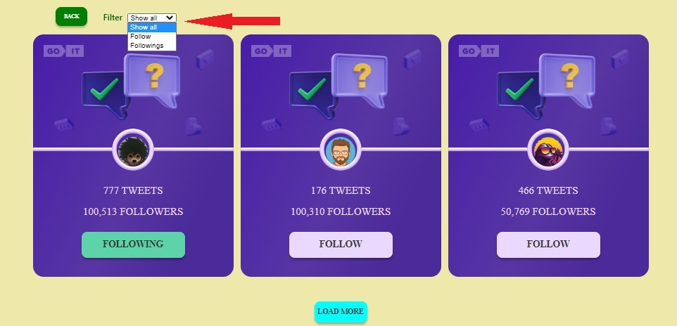
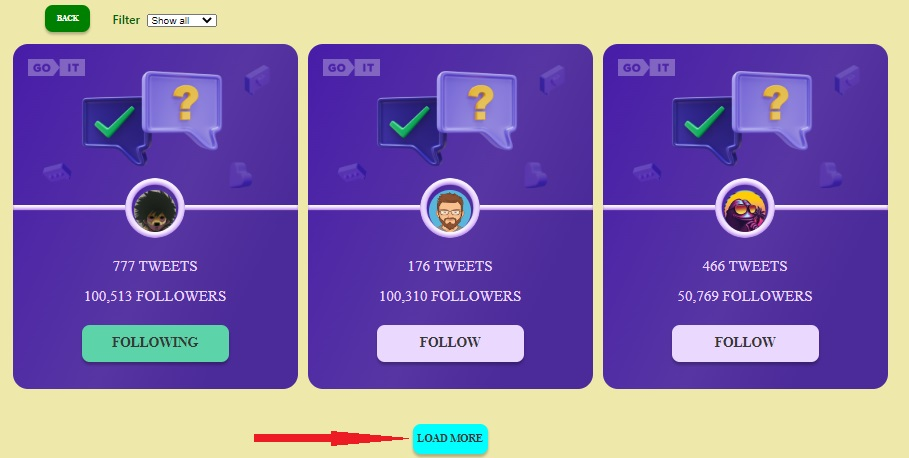
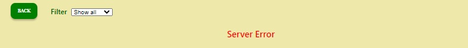
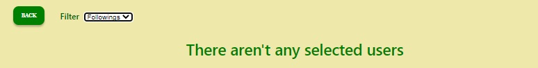

# **_Tweet-pr_**

Цей застосунок створений за допомогою  
[Create React App](https://github.com/facebook/create-react-app).

---

## **_Опис роботи застосунку_**

Адреса застосунку - [e-gap.github.io/tweets-pr/](e-gap.github.io/tweets-pr/)

Застосунок створений для можливості дізнатися, які користувачі створюють твіти,
скільки твітів у кожного користувача, та підписатися на твіти користувачів.

Застосунок складається з двох сторінок:
[Home](https://e-gap.github.io/tweets-pr/) та
[Tweets](https://e-gap.github.io/tweets-pr/tweets).

На сторінці [Home](https://e-gap.github.io/tweets-pr/) ми можемо бачити загальне
оформлення стартової сторінки застосунку із кнопкою `«Go to Tweets»`, натиснувши
яку, можна перейти до сторінки
[Tweets](https://e-gap.github.io/tweets-pr/tweets).

Сторінка [Tweets](https://e-gap.github.io/tweets-pr/tweets) має наступний
вигляд:

На цій сторінці ми можемо бачити користвачів з інформацією по ним. У кожного
користувача є картка із аватаркою та вказанням кількості твітів і підписників.
Якщо ми хочемо стати підписником (або перестати бути) підписником конкретного
користувача, нам слід натичнути кнопку `«FOLLOW»`
 (або `«FOLLOWING»`)

Якщо ми стаєм підписником користувача, то в його картці збільшується кількість
підписників на 1. Якщо відписуємся від користувача - то в його картці
зменшується кількість підписників на 1.

Також на сторінці [Tweets](https://e-gap.github.io/tweets-pr/tweets) у лівому
верхньому куті є кнопка `«BACK»`, 
натиснувши на яку, ми переходимо на сторінку
[Home](https://e-gap.github.io/tweets-pr/).

На сторінці [Tweets](https://e-gap.github.io/tweets-pr/tweets) ми можемо
управляти виведенням на екран користувачів однієї з доступних нам категорій:
`«Shaw all»` (користувачі усіх категорій) `«Follow»` (користувачі, підписниками
яких ми не є) `«Followings»` (користувачі, підписниками яких ми є) за допомогою
фільтра:  Після обрання у фільтрі
потрібної категорії - на сторніці з'являться тыльки картки користувачів обраної
категорії.

По замовчуванню на сторінці [Tweets](https://e-gap.github.io/tweets-pr/tweets)
відображається до трьох карток користувачів однієї категорії. Якщо в базі даних
користувачів обраної категорії більше, ніж ми бачимо на екрані, ми можемо
натиснути кнопку `«LOAD MORE»`
 і тоді на екрані до вже
видимих на екрані користувачів додадуться ще слідуючі (три, а бо менше). Якщо в
базі даних кількість користувачів дорівнює кількості, яку ми вже бачимо на
екрані, тоді кнопка `«LOAD MORE»` перестає відображатися на екрані.

Якщо у нас сталася помилка і нам не доступні користувачі із бази даних, тоді на
екрані з'явиться текст помилки: 

Якщо кількість користувачів обраної категорії в базі даних дорівнює 0Ю то на
екрані з'явиться текст повідомлення: 

---

## **_Використані бібліотеки для створення застосунку_**

[axios](https://axios-http.com/)
[prop-types](https://github.com/facebook/prop-types)
[react-router-dom](https://github.com/remix-run/react-router)
